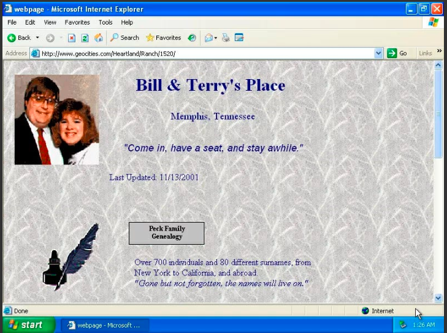
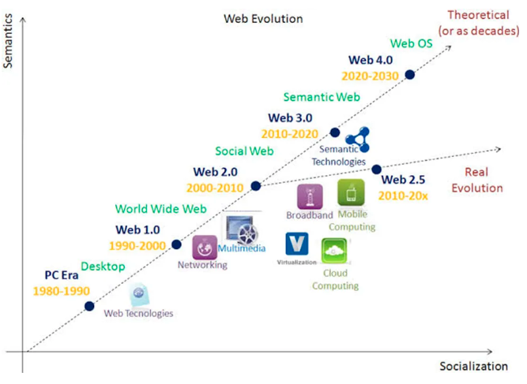
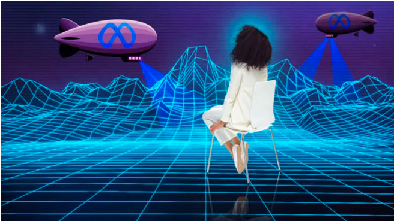

# The evolution of the Internet 

This is a piece of an existing body of writing to help newcomers in web3. 

**Twitter**: [@Mofasasi](https://twitter.com/mofasasi)

**Community**: [Discord](https://discord.gg/NszjsvgqkX) | [Website wtf.academy](https://wtf.academy)  

-----

So, how exactly did we get to “Web 3.0”, the talk of the town? What better way to begin than from the basics?

# Web 1.0

World wide ‘Web’ 1.0 is the earliest version of the internet. It was notorious in the 20th century (1901 – 2000). You would say not too far from now, right? Right.

It is also called the Read Only Web. That is, if you’re using Web 1.0, you would only be able to read content (on text or image). It is a one-way communication whereby there are no feedbacks. Thus, its rank in interaction is very low, like a one-way road. You only read and take your leave when you’re done.

Examples below:

Click here to have a feel of web 1.0: [elijahlist.com](https://www.elijahlist.com/index.php), a website created by Steve Shultz in 1997. Also, [Cameronsworld.net](https://www.cameronsworld.net/), the Cameron’s world archive from the 1990s.

# Web 2.0

It is also called the ‘‘Read-Write Web’’ or ‘‘Social Web’’ and here we are today (well, at least for now)

It came with a shift in how the internet was used. We now enjoy two-way communication. That is, you'll be able to do more than reading this post. You can comment, and you can reply to a comment. You can tell me if you understand what you’re reading or not. I’m able to know what to do better by also reading your comments and replies. In other words, there is more interaction, and this increases shared knowledge.

Examples include: YouTube, Wikipedia, Facebook, Twitter and other sites.

Wait for it . .  . .

# Web 2.5!

Yes, the focus of everyone is on Web 3.0 and its imminent adoption.

Guess what? That’s not happening today and neither is it tomorrow. Hence, Web 2.5.

Consider Web 2.5 as the windbreaker between the passing of 2.0 and the slow adoption of 3.0. It is the era of much learning and experimentation. Take for instance, the upsurge in decentralized projects—the same for Artificial Intelligence, Metaverse, and acquiring digital assets, to mention a few.

Here comes the big guy . . .

# Web 3.0

This is called the “Read-Write-Execute Web’’.

Machine learning and artificial intelligence pop up here. On Web 3.0, ML and AI help internet users execute information.

For example, we see this in Google Assistant and Siri. One key feature is that users find desired content faster. The internet and the users have a heightened interaction.

*Illustration “Hey google, what’s this song, Hey Siri, Play me Victory by . . .”*

Much more, it is built for your content to find you. For example, autosuggestion. It picks the word from your mouth/fingers. Before you say/type it, it has popped up.

**Another key feature Web3 advertises is De-centralization.**

For instance, Mark Zuckerberg owns Facebook and he set the rules (this is centralization). This is not so on Web 3.0. (Which Mark is working on, AKA Meta)

Everything on the internet will run on a decentralized platform e.g Blockchain (we'll talk about this soonest)

Being banned, blocked or sanctioned is nothing to worry about. Users can post anything and whenever.

That’s something, isn’t it?

## Summary

In this piece, we discussed the evolution of the internet as a basis for understanding Web3. 

**Post-Class Assignment**: Look through the internet for more examples of web1,2 & 3 platforms.

