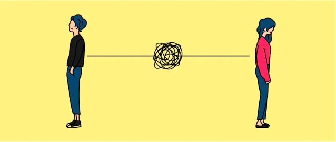
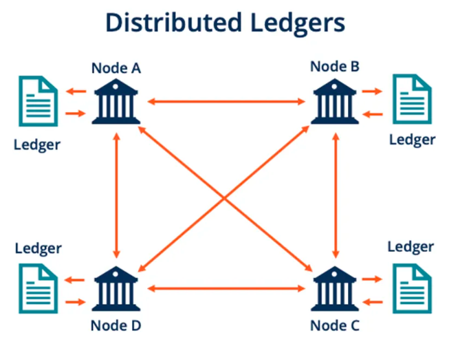

# The Blockchain and How it works

This is a piece of an existing body of writing to help newcommers in web3. 

**Twitter**: [@Mofasasi](https://twitter.com/mofasasi)

**Community**: [Discord](https://discord.gg/NszjsvgqkX) | [Website wtf.academy](https://wtf.academy)  

-----

Did you know that the Blockchain was invented because of trust issues!?

Apparently, people have always tampered with information before now. I know this because in 1991, Stuart Haber and Scott Stornetta had similar issue.

’’Why can’t I trust that this debit receipt you’re showing me is authentic?” Scott asked Stuart. “How do we fix this?” Scott quickly added. (okay, not literally but stay with the flow ;)

To establish trust in any exchange of information, the duo decided to invite the whole world to be a witness whenever people transact.

Picture it this way: We both have a plate of meal to share but just before the first scoop, there is a need for me to visit the restroom. To trust you with our meal, I go live on Instagram and place the phone right before you, the meal and the whole world.

Voila, The Blockchain!

If you don’t believe it’s that simple, read on . . .

# How it Works . . .

**The blockchain serves as a record book of transactions.**

However, unlike the traditional record keeping, no single person holds this record. It is distributed among many people (as said earlier, the whole world).

This is why the Blockchain is also called Distributed Ledger Technology. 

Since everyone can see this ledger, you’d agree it is difficult to tamper with it.

If a transaction is to be carried out, everyone gets a notification and approves it.

If any transaction is initiated but violates the ledger in one way or another, again, everyone gets a notification but this time to disapprove it. (nice try, sly)

In 2009, Satoshi Nakamoto took this technology into practice by developing the first decentralized cryptocurrency, Bitcoin. Read more here: [Satoshi's development](https://coingeek.com/stuart-haber-and-scott-stornetta-how-our-timestamping-mechanism-was-used-in-bitcoin-video/)

The development by Satoshi Nakamoto has led to even more developments of cryptocurrencies built on the Blockchain.

Scott and Stuart were big dreamers. They knew their innovation could do more than financial transactions. They wanted it for everything digital (songs, movies, articles, photographs, everything)

Thinking about it, that would eradicate a lot of ownership issue such as copyright infringement, piracy, privacy policy and plagiarism, don’t you think?

Recently, it has been observed that they are already living their dreams, AKA Non-Fungible Tokens (NFTs) (we’ll talk about this later)

*Whispers: dream big dreams, guys.*

# Why should I care?

Remember the last time I wrote to you about Web 3? Remember we spoke about the future? Did you miss it? Catch up here: [The evolution of Internet](https://github.com/Mosamorphing/WTF-Blog/tree/main/TheMorphing500/01%20-%20The%20evolution%20of%20internet)

The future of internet will be built on the Blockchain.

In other words, it’s either you’re forced to make a shift into the blockchain technology or you just simply start to care. Either way, it is the future and it is right now staring you in the eye.

If you ask me, its benefits are enormous. First of them all is that it helps to build trust among people. The world would be a better place if we can trust each other more, right?

[Learn more about Blockchain technology](https://academy.binance.com/en/articles/what-is-blockchain-and-how-does-it-work)
