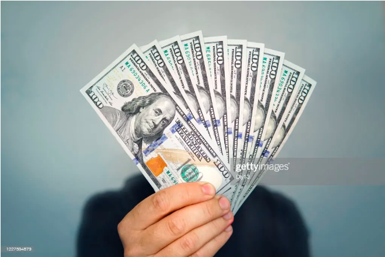
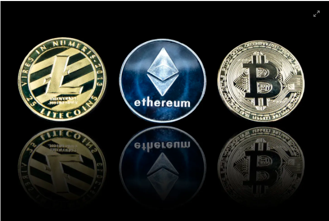

# Cryptocurrency: Pros & Cons

This is a piece of an existing body of writing to help newcommers in web3. 

**Twitter**: [@Mofasasi](https://twitter.com/mofasasi)

**Community**: [Discord](https://discord.gg/NszjsvgqkX) | [Website wtf.academy](https://wtf.academy)  

-----

Yes, Imagine that we no longer have tangible monies. You'd ask, ‘how do I buy and sell?’

Your answer; Cryptocurrency!

When you think of buying and selling, you think of money. Why? The medium of exchange for goods and services is money.

Examples include the dollar, naira, pounds, Euro and 176 other recognizable currencies.

There is yet one binding feature in the afore-listed currencies; they are tangible. You can see, touch and feel them.

Cryptocurrency is also a form of money, a medium of exchange.  What makes it different from other forms are:

- It is intangible

It cannot be seen, touched or felt. You cannot stack it up in your piggybank. It is a virtual currency. Like the coins you acquire when you play games like Dream league soccer and Candy Crush saga. Only that cryptocurrency has real-time value.

- It is independent of the government

Yes, you read that right. Totally government/bank free. How?

It runs on the blockchain technology. Good thing about this is that it is decentralized. No single person has the power to control the currency. This is generally called Decentralized Finance (DeFi).

If you’d like to read more on the blockchain technology, click [here](https://github.com/Mosamorphing/WTF-Blog/tree/main/TheMorphing500/02%20-%20The%20Blockchain%20and%20How%20it%20Works)

Examples of cryptocurrency include Bitcoin, Ethereum, Tribe, Solana, Dogecoin and 9000 more.

# Cryptocurrency has more to offer

- The Blockchain is a solid system and it takes extreme amount of work to hack into it. So, technically your money is safer. Also, you’re finally off the hook of bank paper verifications and unexplainable charges.

- It also reduces the risk of corruption, bribery and fraud. Imagine the government of your nation allocates the year’s budget via cryptocurrency. It will be very easy to track how finances are spent.

- Cryptocurrency offers a borderless and timeless financial system. It has never been easier to send money from one end of the world to another in short time and with lesser stress. Thanks to cryptocurrency payment platforms such as Binance Pay.

# Any downside at all?

- Cryptocurrencies are volatile.

One of the reasons that contribute to this is the law of demand and supply. When the demand of a currency increases quicker than the supply, the price shoots up. Also, investors like Elon Musk contribute to the fluctuating price. I mean, if the world’s richest man tweets, you’d better take him serious. Even if it’s a joke, it’s definitely expensive (pun intended)

- Say goodbye to customer care service.

Cryptocurrency is a financial system that operates without intermediates. In other words, should you be held in a tight fix with a transaction at any time, there is no way to make a complaint.  For example, sending money to a wrong wallet address. Eish!

## Summary

In this piece, we discussed cryptocurrencies, the pros and the cons. Cryptocurrencies continue to gain notoriety and it is important to know what’s working and what’s not. When we know these, we’d be able to make better plans for the future.
