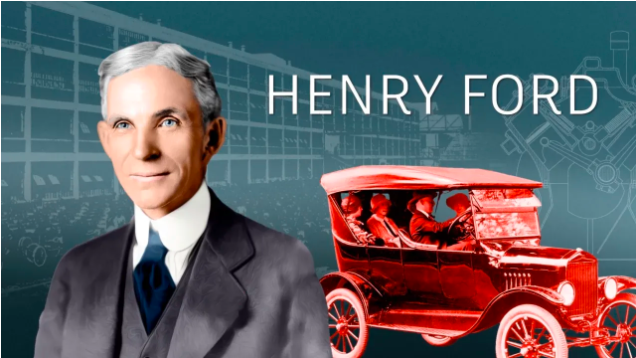

# What are Smart Contracts and DAOs?

This is a piece of an existing body of writing to help newcomers in web3. 

**Twitter**: [@Mofasasi](https://twitter.com/mofasasi)

**Community**: [Discord](https://discord.gg/NszjsvgqkX) | [Website wtf.academy](https://wtf.academy)  

-----

Computers speak in 0s and 1s and if any command is given within that language, a corresponding feedback is given. If you click ‘delete’, you automatically get a prompt to delete a selected file, you don’t get a prompt that asks you if you want to play a game. 

The above illustration can be likened to Smart Contracts; they are fundamentally programmed instructions automatically executed when set conditions are met. These sets of programmed instructions are the foundations on which DAOs are erected. More like the laid down rules the DAO operates. The question is, what are DAOs (Decentralized Autonomous Organizations?) 

Traditional organizations typically have a setting where there are several workers who take orders from a central boss. In DAOs, there are ‘workers’ but there is no order to take from no one as there is no central boss. The decision-making power is spread (decentralized) among every member of the DAO.

## Why are DAOs Created?

Cripple Monopoly:

Henry Ford belonged to the Association of Licensed Automobile Manufacturers (ALAM) but in 1903, he had a brilliant idea of creating the fastest car at the time and submitted his proposal to the association for approval. However, Henry Ford was denied a license. 

He wasn’t going to allow this association smother his dream and so, against all odds, he went on to produce his first-ever car, made a public show of it by winning a race against the reigning car at the time, attracted investors, and eventually built his manufacturing company. This is how DAOs work! 

If you have a passion for contributing to social good, blockchain technology has made it easier to fulfill your passion. There is no need of waiting for a license like Henry Ford. All you need is a developer to write a smart contract (that contains how your DAO will run), a beta-testing of it (like Henry Ford did), invite people of like-passion to join and begin to implement. 

Encourage Decentralization: 

In DAOs, there is no central boss. For every decision that will be executed, a proposal is submitted. If the proposal gets approved, a voting window opens for every member to take a stance. If the voting is in support of the decision, it takes effect. If the voting is not in support, it is rendered null. This method encourages co-ownership, transparency and an inclusive environment where everyone’s idea matter. 

## What challenges do DAOs face?

The top 2 challenges faced by DAOs are Security and Human error. 

Security:

DAOs operate digitally, and they need to be secure from hackers and attacks. Following the famous [hack of a DAO in June 2016,](https://medium.com/swlh/the-story-of-the-dao-its-history-and-consequences-71e6a8a551ee) a number of DAOs have also been hacked which has led to the loss of millions and millions of dollars.

Human error: 

Although smart contracts are in place to automate the DAO, a large percentage of DAOs’ operations are still carried out by humans and well, we make mistakes. Grave mistakes, sometimes.

Ponder this: Do you think DAOs will replace traditional organizations?
