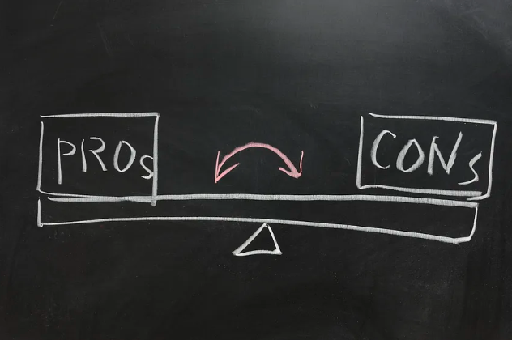

# Proof of Work & Proof of Stake

This is a piece of an existing body of writing to help newcomers in web3. 

**Twitter**: [@Mofasasi](https://twitter.com/mofasasi)

**Community**: [Discord](https://discord.gg/NszjsvgqkX) | [Website wtf.academy](https://wtf.academy)  

-----

NB: Proof of Work = PoW, Proof of Stake = PoS, Ethereum = ETH

Around August 2022, there was a buzz around Ethereum transitioning from PoW to PoS mechanism. I didn’t even know what PoW was, now PoS? But I dug the internet and found a couple of helpful pieces of information. Worry not about the technicalities, I’ll be explaining everything as simply as possible, in 500 words!

## What is PoW?

Simply, it is the proof of the work done. Work done by who? Ethereum Miners. Who are Ethereum Miners? Just like gold is mined, ETH is mined as well and those who mine it are called miners. Unlike gold, ETH is not mined from the ground. ETH is a digital currency and mining digital currencies take quite a different approach. To mine ETH, miners have to solve complex mathematical puzzles and only then can they have the right to add a new block in the blockchain, and then get paid the miner’s reward. 

Just like solving mathematical equations in real life, there are ‘workings’ for different kinds of equations. The algebraic, simultaneous, quadratic, geometric . . and a host of them all have workings to show how answers are arrived at. For a block to get added by a miner, they must have shown their ‘workings’ for verification and validation. I.e these ‘workings’ are proofs that they actually did the work (Proof of Work *wink wink*)

## What is PoS?

Here, there are no miners and that means there are no long, complex mathematical equations to solve. How then are new blocks of transactions created? There are Stakers (AKA Validators). They are those who ‘stake’ (or invest) in the network (whatever cryptocurrency). The higher the stake, the higher the chance of being selected for adding and validating new blocks. 

Every stake serves as a form of collateral and it must be greater than the ‘miner’s reward’. Just like PoW where workings are shown, blocks are validated by a number of validators before it is finalized.

**Pros of PoW**

Security: PoW is considered highly secure because it requires complex mathematical puzzles. It makes it difficult for malicious actors to take control of the network.

Familiar and Tested: PoW has been extensively used and tested in cryptocurrencies like Bitcoin, proving its effectiveness and reliability over time.

**Cons of PoW**

Energy Consumption: PoW systems require significant computational power, leading to high energy consumption. This has raised concerns about environmental impact and sustainability. 

Centralization Risks: Despite the intention of decentralization, PoW can sometimes result in mining centralization (called Mining pool), where a few powerful entities control a significant portion of the mining power.

**Pros of PoS**

Economic Incentives: PoS allows users to participate in and validate transactions based on the amount of cryptocurrency they hold. It aligns economic incentives and reduces the need for expensive mining equipment.

Energy Efficiency: PoS requires significantly less energy compared to PoW since it doesn't rely on resource-intensive mining operations.

**Cons of PoS**

Potential for Centralization: PoS may lead to centralization if a small number of participants hold a significant portion of the cryptocurrency supply, as they have more influence over the network.

Security Concerns: PoS introduces different security risks, such as the "nothing at stake" problem and the potential concentration of power in the hands of those with the most coins.

That’s it, folks! See you in the next one!
