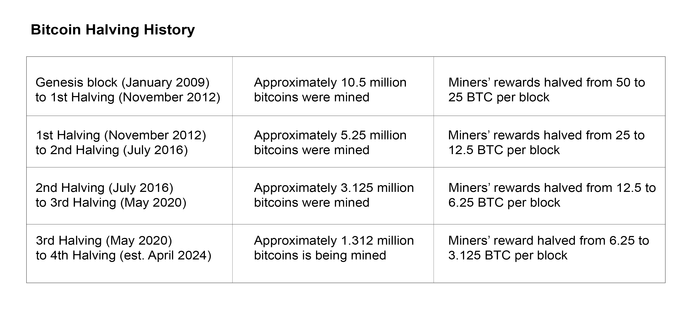

# What is Bitcoin Halving?

This is a piece of an existing body of writing to help newcomers in web3. 

**Twitter**: [@Mofasasi](https://twitter.com/mofasasi)

**Community**: [Discord](https://discord.gg/NszjsvgqkX) | [Website wtf.academy](https://wtf.academy)  

-----

Bitcoin halving is an event that occurs approximately every 4 years where the reward that Bitcoin miners receive for mining a block is cut in half. This event has occurred since Bitcoin's creation in 2009, with the first in 2012, the second in 2016, the third in 2020, and the fourth in … you guessed right … 2024. It is estimated to occur in about 54 days from now in April. 

Now, who are the miners? Why do they mine the block? And why is their reward halved every 4 years? Let’s find out.

# The Miners and Why They Mine

Bitcoin miners are individuals who do the hard work of validating and adding new transactions to the Bitcoin blockchain.

Let’s say I want to send 0.001 BTC to your Bitcoin wallet. Once I input your address in my Bitcoin wallet and send the transaction, it is broadcast to the Bitcoin network. Bitcoin miners pick it up from the network, verify its legitimacy and then add it as a new block to the Bitcoin blockchain. After the addition, your wallet is credited. This process is called “mining”.

For every new block (or transaction) they add, they get rewarded in $BTC. This is noteworthy because many find the term “bitcoin miners” misleading to think that these miners directly mine the Bitcoin. Technically, no, not exactly. They get rewarded after putting resources to work and getting transactions on the blockchain. So, in essence, they mine for the users and they in turn get rewarded. Either way, their actions bring about a supply of more $BTC.

Note: While this piece is focused on Bitcoin, this mining process is similar across different cryptocurrency networks but the terminology differs. While Bitcoin uses miners, some networks go by Validators, Replicators, Delegators, Nominators, etcetera.

# Why Is Their Reward Halved Every 4 Years?

According to the creator(s) of Bitcoin, there can only be a total of 21 million bitcoins in circulation. As of today, there are approximately 19.64 million bitcoins in circulation. If the primary way more $BTC gets into circulation is by ‘mining’ (as established above), halving miners’ reward would therefore mean that there will be fewer $BTC added into circulation between halving years. Observe the trend below: 

This event creates long-term sustainability for Bitcoin’s supply, ensuring that it does not grow indefinitely but creates the anticipation of scarcity. True to that, it has been observed that the price of $BTC increases within the period of a halving event. The scarcity helps in maintaining the value.

Also, by decreasing the miners’ reward, the Bitcoin protocol encourages more competition among miners, which promotes a decentralised network. This ensures that no single entity or group of miners gain control over the majority of the network. 

That will be all for today, frens! Feel free to write back to me.

I’ll be in touch, soon.

