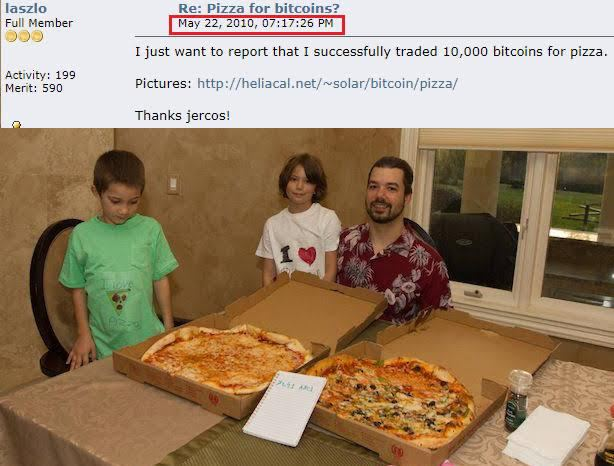
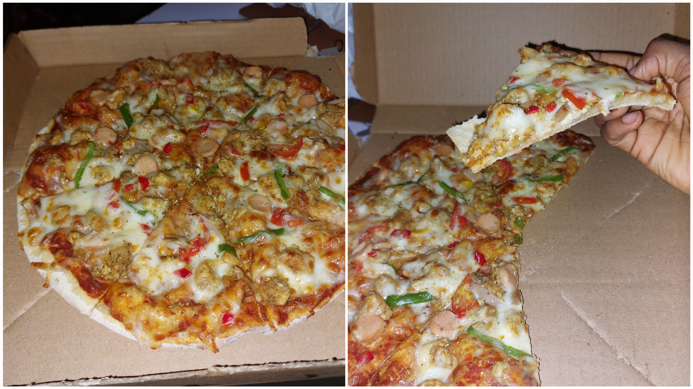

# What is Bitcoin Pizza Day?

This is a piece of an existing body of writing to help newcomers in web3. 

**Twitter**: [@Mofasasi](https://twitter.com/mofasasi)

**Community**: [Discord](https://discord.gg/NszjsvgqkX) | [Website wtf.academy](https://wtf.academy)  

-----

On the 22nd of May, 2010, Bitcoin had its first real-world use case. A Florida programmer, Laszlo Hanyecz, bought 2 large pizzas for 10,000 bitcoins. At the time, bitcoin was not used as a medium of exchange, it was still in the very early stages. In fact, the 10k bitcoin was worth about $40. In contrast, 1 bitcoin is about $70k today.

Laszlo had accrued bitcoin as a [miner’s reward](https://github.com/Mosamorphing/WTF-Blog/tree/main/TheMorphing500/10%20-%20What%20is%20Bitcoin%20Halving%3F#:~:text=Now%2C%20who%20are%20the%20miners%3F%20Why%20do%20they%20mine%20the%20block%3F) and thought of buying some pizzas with it. Remember, no one was taking Bitcoin as a medium of exchange, but he posted his request on a Bitcoin forum nonetheless.

On the 18th of May, 2010, he wrote: 

*“I'll pay 10,000 bitcoins for a couple of pizzas… like maybe 2 large ones so I have some leftover for the next day. I like having leftover pizza to nibble on later. You can make the pizza yourself and bring it to my house or order it for me from a delivery place, but what I'm aiming for is getting food delivered in exchange for bitcoins where I don't have to order or prepare it myself, kind of like ordering a ‘breakfast platter’ at a hotel or something, they just bring you something to eat and you’re happy!*

*I like things like onions, pepper, sausage, mushrooms, tomatoes, pepperoni, etc… just standard stuff no weird fish topping or anything like that. I also like regular cheese pizzas which may be cheaper to prepare or otherwise acquire.* 

*If you’re interested please let me know and we can work out a deal.*

*Thanks,*
*Laszlo.”*

A few days later, on the 22nd, another member of the forum, Jeremy ‘Jercos’ Sturdivant, agreed to deal with Laszlo and accepted his 10k bitcoins for 2 large Papa John’s pizzas.

Although Jercos paid for the Pizzas with his debit card, only facilitating the purchase, this is still recorded as the first documented purchase of physical goods with Bitcoin because from Laszlo’s view, he wanted pizzas for bitcoins, and that was exactly what happened.

This first real-world use case solidified the idea of digital currencies as a medium of exchange of value. I saw a comment that said “This man crawled so we could walk”, I think so too!

Ever since, today has been remembered and celebrated annually among crypto enthusiasts as the “Bitcoin Pizza Day.”

# Curious about what Jercos did with the 10,000 Bitcoins?

Shortly after the transaction, our deal broker sold all of it to [cover expenses](https://www.telegraph.co.uk/technology/2018/05/22/inside-story-behind-famous-2010-bitcoin-pizza-purchase-today/#:~:text=later%20liquidated%20to-,cover%20expenses,-while%20travelling%20the) for travelling the US with his girlfriend at the time. 

‘Oh, snap, imagine if he held it for long. How rich would he be today!?”

I know, I know, I feel you, I feel the same way too. But it was 2010, nobody could have predicted this. 

In case you’re looking for Laszlo, check him out on X [@HanyeczLaszlo](https://x.com/hanyeczlaszlo)

Looking for our broker Jercos? I’m still looking too. If you find him before me, tag me in the comment section. Many thanks!

From my hand to yours, Happy Bitcoin Pizza Day!

